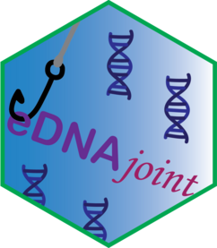

<!-- README.md is generated from README.Rmd. Please edit that file -->

# eDNAjoint



<!-- badges: start -->

[](https://github.com/ropensci/eDNAjoint/actions/workflows/R-CMD-check.yaml)
[](https://codecov.io/gh/ropensci/eDNAjoint)
[](https://github.com/ropensci/software-review/issues/642)
[](https://lifecycle.r-lib.org/articles/stages.html#stable)

<!-- badges: end -->

The package *eDNAjoint* is useful for interpreting observations from
paired or semi-paired environmental DNA (eDNA) and traditional surveys.
The package runs a Bayesian model that integrates these two data streams
to jointly estimate parameters like the false positive probability of
eDNA detection and expected catch rate at a site. Optional model
variations allow inclusion of site-level covariates that scale the
sensitivity of eDNA sampling relative to traditional sampling, as well
as estimation of gear scaling coefficients when multiple traditional
gear types are used. Additional functions in the package facilitate
interpretation of model fits.

<div style="text-align: center;">


</div>

## Installation

The most stable version of *eDNAjoint* can be found on Cran:

``` r
install.packages("eDNAjoint")
```

You can also install the development version of *eDNAjoint* from
ROpenSci:

``` r
install.packages("eDNAjoint", repos = "https://ropensci.r-universe.dev")
```

## Example

The main functionality in *eDNAjoint* is the use of `joint_model()` that
will fit the model to data. Further functions like `joint_summarize()`
and `detection_calculate()` can be used to help with model fit
interpretation.

This example fits the joint model to data from paired, replicated eDNA
qPCR and seine sampling observations of endangered tidewater gobies
(*Eucyclogobius newberryi*) from a study by Schmelzle and Kinziger
(2016). The following variation of the joint model includes site-level
covariates that scale the sensitivity of eDNA sampling relative to
traditional sampling.

``` r
library(eDNAjoint)
data(goby_data)
# run the joint model with two covariates
goby_fit <- joint_model(data = goby_data, cov = c("Filter_time", "Salinity"), 
                        family = "poisson", p10_priors = c(1, 20), q = FALSE)
```

And then this model fit can be accessed to do things like summarize the
posterior distribution for the probability of a false positive
detection, $p_{10}$:

``` r
# summarize p10 posterior
joint_summarize(goby_fit$model, par = "p10")
#>      mean se_mean    sd  2.5% 97.5%    n_eff Rhat
#> p10 0.003       0 0.001 0.001 0.007 14324.77    1
```

Or to find the number of eDNA samples and traditional survey samples
necessary to detect presence of the species at a given expected catch
rate:

``` r
# find the number of samples necessary to detect presence with 0.9 probability 
# at the mean covariate values, if the expected catch rate (mu) is 0.1, 0.5, or 
# 1 individuals/traditional survey unit.
detection_calculate(goby_fit$model, mu = c(0.1, 0.5, 1), 
                    cov_val = c(0, 0), probability = 0.9)
#>       mu n_traditional n_eDNA
#> [1,] 0.1            24     14
#> [2,] 0.5             5      4
#> [3,] 1.0             3      2
```

## Vignette

You can find much more detailed examples of the functions in *eDNAjoint*
and the model underlying the package in the [package
vignette](https://ednajoint.netlify.app/).

## Contributing

Interested in contributing to this package? See [some notes on
contributing](https://github.com/ropensci/eDNAjoint/blob/master/CONTRIBUTING.md).

## Code of Conduct

Please note that eDNAjoint is released with a [Contributor Code of
Conduct](https://ropensci.org/code-of-conduct/). By contributing to this
project you agree to abide by its terms.

## References

Keller, A.G., Grason, E.W., McDonald, P.S., Ramon-Laca, A., Kelly, R.P.
(2022). Tracking an invasion front with environmental DNA. *Ecological
Applications*. 32(4): e2561. <https://doi.org/10.1002/eap.2561>

Schmelzle, M.C. and Kinziger, A.P. (2016). Using occupancy modelling to
compare environmental DNA to traditional field methods for
regional-scale monitoring of an endangered aquatic species. *Molecular
Ecology Resources*. 16(4): 895-908.
<https://doi.org/10.1111/1755-0998.12501>
